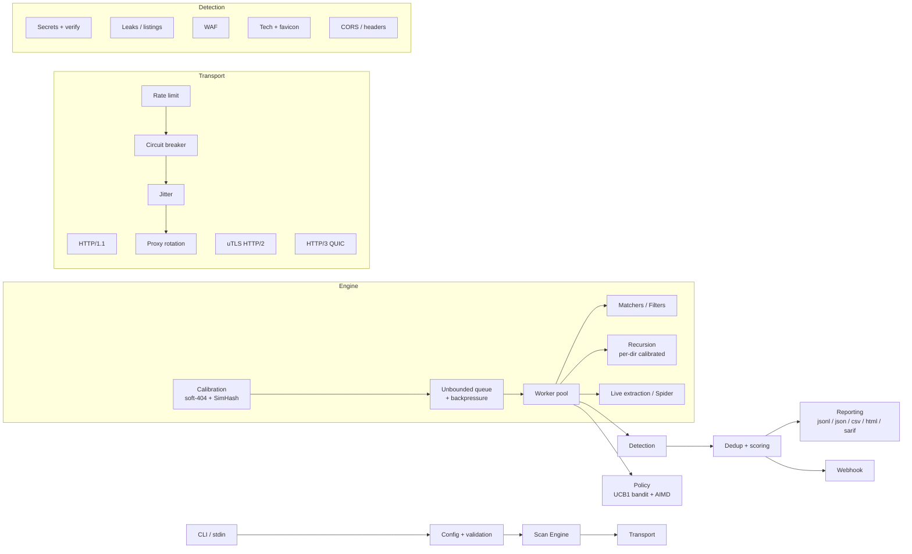

<div align="center">

# 🌶 Capsaicin

### Fast, intelligent web content discovery engine — built for security professionals

*Surgical directory & asset discovery with smart calibration, ffuf-style matchers, multi-wordlist fuzzing, JA3/JA4 evasion, and adaptive intelligence.*

[](https://go.dev)
[](LICENSE)
[](.github/workflows/ci.yml)
[]()
[]()
[]()

```text
   🌶  C A P S A I C I N
   ▔▔▔▔▔▔▔▔▔▔▔▔▔▔▔▔▔▔▔▔▔▔▔▔▔▔▔▔▔▔▔▔▔▔
   web content discovery  ·  v3.1  ·  fast · adaptive · evasive
```

</div>

---

## Why Capsaicin?

Most directory brute-forcers stop at *"send words, print 200s."* Capsaicin treats discovery as an **intelligence problem**: it calibrates each target's noise floor, adapts its pacing to how the host pushes back, evades fingerprinting at the TLS layer, and enriches every finding with severity, tech tags, and leak/secret classification — then hands you a report your team can actually triage.

- 🎯 **Zero-config accuracy** — automatic soft-404 calibration (size + word + line + SimHash) kills false positives, per-directory during recursion.
- 🧩 **ffuf-grade fuzzing** — matchers/filters, the `FUZZ` keyword, and multi-wordlist **clusterbomb**/**pitchfork** modes.
- 🕵️ **Findings that matter** — leaked `.git`/`.env`/backups, 26 secret patterns with **live validation**, directory listings, CORS/header posture, favicon (Shodan) hashes.
- 🥷 **Evasion built in** — uTLS JA3/JA4 impersonation, HTTP/2 + HTTP/3, stochastic jitter, per-host circuit breaker, proxy rotation, custom DNS/SNI.
- 🧠 **Adaptive** — a UCB1 bandit learns the best 403/401 bypass per host; AIMD congestion control paces the scan to avoid blocking.
- 📦 **Pipeline-native** — clean stdout data channel, five report formats (incl. **SARIF** for GitHub code scanning), webhooks, resumable sessions, CI exit gates.

---

## ✨ Feature Matrix

| Area | Capabilities |
|------|--------------|
| **Accuracy** | Smart 404 calibration · SimHash near-duplicate soft-404 · rolling recalibration · **per-directory** calibration · request-level dedup |
| **Fuzzing** | `FUZZ` keyword · matchers/filters (`-mc/-ms/-mr/-fc/-fs/-fw`) · multi-wordlist **clusterbomb**/**pitchfork** · method + body (`-X`/`-d @file`) · recursion · virtual-host fuzzing |
| **Discovery** | `--spider` (robots/sitemap/JS) · live JS/HTML link extraction · OpenAPI/Swagger/GraphQL spec mining · favicon fingerprint |
| **Detection** | 26 secret patterns + entropy + **live verification** · `.git`/`.env`/backup/source-map/db-dump leaks · directory listing · CORS & security-header audit · 18 WAF signatures · 28 tech tags |
| **Evasion** | uTLS JA3/JA4 (14 ClientHello profiles) · HTTP/2 + real HTTP/3 (QUIC) · coherent header profiles · Gaussian/Pareto jitter · proxy rotation · custom `--resolvers` / `--sni` |
| **Bypass** | 403/401 header-manipulation engine · method fuzzing on 405 · per-host **UCB1 bandit** adaptive bypass |
| **Resilience** | Per-host circuit breaker · **AIMD** adaptive pacing · global `--max-duration` · `--resume` checkpoints · deadlock-free unbounded queue with backpressure |
| **Output** | `jsonl` · `json` (schema 3.1) · `csv` · **interactive HTML** · **SARIF** · live stdout streaming · Slack/Discord webhooks · CI `--fail-on` gates |

---

## 🚀 Quick Start

### Install

```bash
go install github.com/abdulhalimaltuntas/capsaicin/cmd/capsaicin@latest
```

Or build from source:

```bash
git clone https://github.com/abdulhalimaltuntas/capsaicin.git
cd capsaicin
go build -o capsaicin ./cmd/capsaicin
```

### Basic scan

```bash
capsaicin -u https://target.com -w wordlist.txt
```

### Pipeline mode

```bash
cat targets.txt | capsaicin -w wordlist.txt -t 100 --output-format jsonl -o - | jq
```

> **stdout is a pure data channel.** The banner, progress bar, and logs go to **stderr**, so `-o -` streams clean JSONL you can pipe straight into `jq`, `nuclei`, or your own tooling.

---

## 📖 Usage Examples

**Authenticated + extensions**
```bash
capsaicin -u https://app.target.com -w words.txt \
  -H "Authorization: Bearer $TOKEN" -H "X-Env: staging" -e php,aspx,json
```

**Matchers & filters (ffuf-style)**
```bash
# keep only 200/301, drop the 8180-byte soft-404 and any 3-word body
capsaicin -u https://target.com -w words.txt --match-code 200,301 --filter-size 8180 --filter-words 3
```

**Multi-wordlist — clusterbomb**
```bash
capsaicin -u 'https://api.target.com/W1/W2' \
  -w endpoints.txt:W1 -w ids.txt:W2 --mode clusterbomb
```

**API fuzzing with POST body from a file**
```bash
capsaicin -u 'https://api.target.com/graphql' -X POST -d @query.json \
  -H "Content-Type: application/json" --match-regex '"errors"'
```

**Full-intelligence recon**
```bash
capsaicin -u https://target.com -w words.txt \
  --mode dynamic --spider --extract-paths \
  --adaptive-rate --headless \
  --h2 --tls-impersonate chrome \
  --verify-secrets --max-duration 900 \
  --output-format html -o report.html
```

**Virtual-host discovery**
```bash
capsaicin -u https://10.0.0.5/ -w subdomains.txt --vhost
```

**CI gate + SARIF for GitHub code scanning**
```bash
capsaicin -u https://staging.target.com -w words.txt \
  --output-format sarif -o capsaicin.sarif --fail-on high --silent
# exit 2 → the pipeline fails when a high/critical finding exists
```

**Resumable long scan through rotating proxies**
```bash
capsaicin -u https://target.com -w huge.txt \
  --proxy-file proxies.txt --proxy-strategy round_robin \
  --resolvers 1.1.1.1,8.8.8.8 --resume session.state --rate-limit 50
```

---

## ⚙️ Configuration Reference

### Target & Request

| Flag | Default | Description |
|------|---------|-------------|
| `-u` | — | Target URL (supports the `FUZZ` keyword); or pipe targets via **stdin** |
| `-w` | — | Wordlist `path[:KEYWORD]`, **repeatable** for clusterbomb/pitchfork |
| `-X` | `GET` | HTTP method for the primary request |
| `-d` | — | POST body (`@file` reads the body from a file) |
| `-e` | — | Extensions, comma-separated (`php,html,txt`) |
| `-H` | — | Custom header `"Name: Value"` (repeatable) |
| `--mode` | `sniper` | `sniper` · `clusterbomb` · `pitchfork` · `dynamic` (spider + mutation) |

### Matchers & Filters

| Flag | Default | Description |
|------|---------|-------------|
| `--match-code` | `200-299,301,302,307,401,403,405` | Keep only these status codes |
| `--match-size` / `--match-regex` | — | Keep only matching response size / body regex |
| `--filter-code` / `--filter-size` / `--filter-words` | — | Drop matching responses (**filters win over matchers**) |

### Engine & Performance

| Flag | Default | Description |
|------|---------|-------------|
| `-t` | `40` | Concurrent workers |
| `--timeout` | `10` | Per-request timeout (seconds) |
| `--rate-limit` | `0` | Max req/s per host (0 = unlimited) |
| `--depth` | `0` | Recursive scan depth (per-directory calibrated) |
| `--retries` | `2` | Retry attempts for failed requests |
| `--max-duration` | `0` | Whole-scan deadline in seconds |
| `--max-response-mb` | `10` | Max response body read (MB) |
| `--resume` | — | Session file: skip already-scanned endpoints, append new ones |

### Discovery & Detection

| Flag | Default | Description |
|------|---------|-------------|
| `--spider` | `false` | Crawl robots/sitemap/JS + probe OpenAPI/Swagger/GraphQL specs |
| `--extract-paths` | `false` | Scrape HTML/JS responses for new endpoints mid-scan |
| `--extract-depth` | `2` | Max recursion depth for extracted paths |
| `--auto-calibrate` | `false` | Rolling recalibration every `--recal-interval` requests |
| `--vhost` | `false` | Virtual-host fuzzing (fuzz the `Host` header) |
| `--verify-secrets` | `false` | Live-validate detected secrets against their provider (read-only) |
| `--safe-mode` | `false` | Disable bypass attempts and method fuzzing |
| `--adaptive-rate` | `false` | Per-host UCB1 bandit bypass + AIMD auto-slowdown |
| `--headless` | `false` | Solve JS challenges (Cloudflare/DataDome/reCAPTCHA) via a browser |

### Evasion & Network

| Flag | Default | Description |
|------|---------|-------------|
| `--h2` | `false` | Opt-in uTLS (JA3/JA4) HTTP/2 impersonation — auto-falls back to HTTP/1.1 for `http://` and h1-only hosts |
| `--h3` | `false` | Real HTTP/3 (QUIC) transport |
| `--tls-impersonate` | `random` | `chrome` · `firefox` · `safari` · `edge` · `random` · `none` |
| `--jitter` | `moderate` | `aggressive` · `moderate` · `stealth` · `paranoid` |
| `--proxy` / `--proxy-file` | — | Single proxy or a rotating list |
| `--proxy-strategy` | `random` | `round_robin` · `random` · `failover` |
| `--resolvers` | — | Custom DNS resolver(s) `host[:port]` (repeatable) |
| `--sni` | — | TLS SNI override |
| `--cb-threshold` / `--cb-reset` | `20` / `30` | Circuit-breaker failures before opening / seconds open |

### Output & Integrations

| Flag | Default | Description |
|------|---------|-------------|
| `-o` | — | Output file (`-` = stdout) |
| `--output-format` | `jsonl` | `jsonl` · `json` · `csv` · `html` · `sarif` |
| `--webhook` | — | Slack/Discord/generic URL notified of findings |
| `--webhook-min-severity` | `high` | Minimum severity to notify |
| `--fail-on` | — | Exit code 2 if any finding ≥ threshold |
| `--allow` / `--deny` | — | Host scope with `*` wildcard (repeatable) |
| `--silent` / `--no-color` | `false` | Suppress UI / disable color (also honors `NO_COLOR` & non-TTY) |
| `--log-level` / `--debug` | `info` | `--debug` reveals **why** requests fail (DNS/TLS/timeout/CB) |

> 💡 Key numeric flags are also settable via `CAPSAICIN_`-prefixed environment variables (e.g. `CAPSAICIN_THREADS=100`).

---

## 🏗 Architecture



**Design notes**

- **Deadlock-free queue.** An unbounded, condition-variable queue with initial-feed backpressure — workers never block on fan-out (recursion/extraction), and huge wordlists don't materialize all at once.
- **One transport pipeline.** Calibration, spider, and every scan request share the same rate-limit / circuit-breaker / jitter / uTLS path, so evasion and pacing stay consistent.
- **Single source of truth for findings.** A deduplicator keeps one entry per `URL+Method` (highest severity, first-seen order); the report is read back from it, never from a parallel slice.

---

## 🔑 Detection Capabilities

| Category | Coverage |
|----------|----------|
| **Secrets** (26 patterns) | AWS · GCP · GitHub · GitLab · Slack · Stripe · OpenAI · JWT · Private Keys · DB connection strings · Discord · Telegram · SendGrid · Twilio · Shopify · NPM · and more — with Shannon-entropy gating and opt-in **live validation** |
| **Exposures** | `.git` / `.svn` / `.hg` · `.env` · backups (`.bak`/`.old`/`~`/…) · source maps · DB dumps · `wp-config`/`web.config`/`.htpasswd`/SSH keys · directory listings |
| **Posture** | `Access-Control-Allow-Origin: *` · missing HSTS / X-Frame-Options / nosniff |
| **WAF** (18 signatures) | Cloudflare · Akamai · Imperva · AWS WAF/Shield · F5 · Sucuri · DataDome · Wordfence · ModSecurity · Fastly · Incapsula · … (header, cookie & body based) |
| **Fingerprinting** | 28 server/framework tags · favicon **mmh3** hash for Shodan/Censys pivoting |

### Risk scoring

Every finding carries a **severity** (`critical`→`info`), **confidence** (`confirmed`/`firm`/`tentative`), and **tags**. Verified secrets and VCS/`.env` exposures escalate to `critical`; bypasses and backups to `high`; directory listings, source maps and CORS wildcards to `medium`.

---

## 🚦 CI/CD Integration

```yaml
# GitHub Actions — fail the build on high/critical findings and upload SARIF
- name: Capsaicin scan
  run: |
    capsaicin -u https://staging.example.com -w words.txt \
      --output-format sarif -o capsaicin.sarif \
      --fail-on high --silent
- uses: github/codeql-action/upload-sarif@v3
  if: always()
  with:
    sarif_file: capsaicin.sarif
```

| Exit code | Meaning |
|-----------|---------|
| `0` | No findings at or above `--fail-on` threshold |
| `1` | Scan error (bad config, unreachable target) |
| `2` | Findings met the `--fail-on` threshold |

---

## 🧪 Development

```bash
go build ./...                 # build
go test ./...                  # unit + integration tests
go test -race ./...            # race detector (clean)
go test ./... -cover           # coverage (~71%)
go vet ./... && gofmt -l .     # static analysis + formatting
```

CI runs build, tests, race detector, a coverage gate, `golangci-lint`, `govulncheck`, and `gosec` across Go 1.26 and stable.

---

## ⚖️ Responsible Use

Capsaicin is built for **authorized** security testing — your own assets, engagements with written permission, CTFs, and lab environments. Scanning systems you do not own or have explicit permission to test may be illegal. You are solely responsible for how you use this tool. The authors assume no liability for misuse or damage.

---

## 🤝 Contributing

Issues and pull requests are welcome. Please keep changes `gofmt`-clean, add tests for new behavior, and make sure `go test -race ./...` stays green.

## 📄 License

[MIT](LICENSE) © Capsaicin contributors
